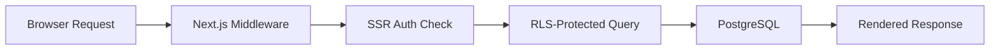
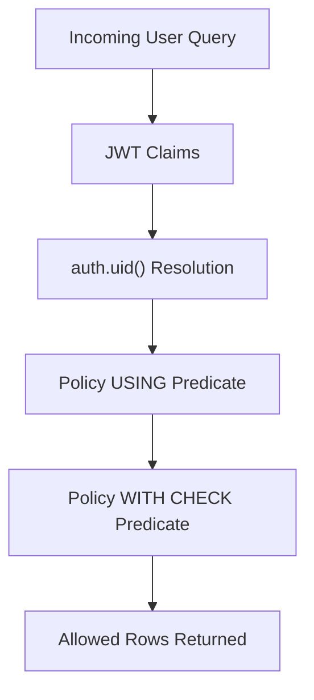
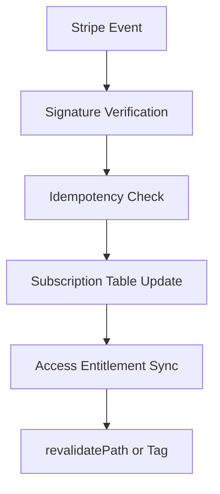
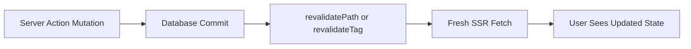

# Awesome Supabase Resources 

A curated list of Next.js + Supabase resources focused on what breaks **after** you deploy: RLS empty-result bugs, SSR session loss, middleware redirect loops, Stripe webhook reliability, and cache invalidation after Server Actions.

Most tutorials stop at "it works on localhost." This list starts where production problems begin.

## Contents

- [Production Incident Index](#production-incident-index)
- [Production Flows](#production-flows)
- [Who This Is For](#who-this-is-for)
- [Reference Assets](#reference-assets)
- [Production SaaS Stack](#production-saas-stack)
- [Curated Resources](#curated-resources)
- [Curation Standards](#curation-standards)

## Production Incident Index

The fastest entry point when you are debugging under time pressure. It maps **symptom → root cause → fix → reusable reference asset**.

Open the Production Incident Index in the Reference Assets section below. When an incident hits: find the symptom, apply the fix, then run the linked checklist or SQL asset to prevent the regression.

## Production Flows

The four flows where most Next.js + Supabase bugs actually live.

### Request Lifecycle

### RLS Request Flow

### Stripe Webhook Reliability

### Cache Invalidation Flow

## Who This Is For

- Engineers shipping Next.js + Supabase SaaS products to production.
- Teams debugging auth, RLS, billing, and cache invalidation incidents.
- Founders and maintainers who need a reliable architecture baseline.

## Reference Assets

Practical, copy-ready assets maintained in this repo.

| Asset                                                                                              | Use It For                                         |
| -------------------------------------------------------------------------------------------------- | -------------------------------------------------- |
| [Production Incident Index](reference/incident-index/README.md)                                    | Symptom-first incident triage.                     |
| [Debugging Playbook](content/debugging-playbook/README.md)                                         | Auth, RLS, hydration, and API connection fixes.    |
| [Production Checklists](content/production-checklists/README.md)                                   | Release safety gates before deploy.                |
| [Zero-Downtime Rollout Checklist](reference/checklists/zero-downtime-rollout-checklist.md)         | Sequencing a deploy under live traffic.            |
| [RLS Audit SQL](reference/sql/rls-audit.sql)                                                       | Finding policy gaps before they leak data.         |
| [Stripe Webhook Idempotency Template](reference/templates/stripe-webhook-idempotency-template.sql) | Making billing event handling safe to retry.       |
| [Migration Rollback Playbook](reference/playbooks/migration-rollback-playbook.md)                  | Recovering from a failed release.                  |
| [Server Actions Debugging Matrix](reference/playbooks/server-actions-debugging-matrix.md)          | Diagnosing stale UI after a mutation.              |
| [Snippets](content/snippets/README.md)                                                             | Reusable auth, middleware, RLS, and API helpers.   |
| [Open Source Examples](content/open-source-examples/README.md)                                     | Studying real production-grade reference projects. |

## Production SaaS Stack

| Layer                  | Typical Choice                           | What It Solves In Production                                        |
| ---------------------- | ---------------------------------------- | ------------------------------------------------------------------- |
| Frontend and rendering | Next.js App Router                       | SSR boundaries, route-level caching, and controlled mutation paths. |
| Auth and sessions      | Supabase Auth + SSR package              | Cookie-based sessions for Server Components and protected routes.   |
| Authorization          | Supabase RLS on PostgreSQL               | Tenant-safe access control at the data layer.                       |
| Billing                | Stripe Billing + webhooks                | Entitlements and subscription lifecycle events.                     |
| Async and workflows    | Supabase Edge Functions + queues         | Background jobs, retries, and side-effect isolation.                |
| AI and search          | pgvector + RAG pipeline                  | Semantic retrieval with controlled indexing and refresh strategy.   |
| Observability          | Sentry + runtime logs + synthetic checks | Error tracing, incident triage, and release confidence.             |
| CI/CD and migrations   | GitHub Actions + migration scripts       | Safe deploy sequencing and schema change discipline.                |

## Curated Resources

### Authentication and Sessions

- [Supabase Auth Quickstart for Next.js](https://supabase.com/docs/guides/auth/quickstarts/nextjs) - Official baseline for App Router auth setup.
- [Supabase Server-Side Auth](https://supabase.com/docs/guides/auth/server-side) - Canonical SSR session and cookie guidance.
- [Supabase SSR Package](https://github.com/supabase/ssr) - Current helpers for server-bound auth flows.
- [Next.js Authentication Guide](https://nextjs.org/docs/app/guides/authentication) - Framework-level auth, session, and authorization patterns.
- [Next.js Environment Variables](https://nextjs.org/docs/app/guides/environment-variables) - Secrets and public key boundaries.

### RLS and Security

- [Supabase Row Level Security](https://supabase.com/docs/guides/database/postgres/row-level-security) - Primary RLS reference.
- [RLS Performance and Best Practices](https://supabase.com/docs/guides/troubleshooting/rls-performance-and-best-practices-Z5Jjwv) - Policy performance and index alignment.
- [Supabase Security Suite](https://supabase.com/blog/hardening-supabase) - Platform-level hardening patterns.
- [PostgreSQL EXPLAIN](https://www.postgresql.org/docs/current/using-explain.html) - Query plan analysis for policy-heavy tables.

### Production Debugging

- [Next.js Hydration Error Guide](https://nextjs.org/docs/messages/react-hydration-error) - Root causes and framework-level fixes.
- [Supabase Troubleshooting](https://supabase.com/docs/guides/troubleshooting) - Official issue diagnosis entry point.
- [Chrome DevTools Network Panel](https://developer.chrome.com/docs/devtools/network/) - Request, cookie, and redirect inspection.
- [Vercel Runtime Logs](https://vercel.com/docs/logs/runtime) - Production route and runtime diagnostics.

### Testing

- [Supabase Database Seeding](https://supabase.com/docs/guides/local-development/seeding-your-database) - Populate and reset database state for testing.
- [Next.js Testing Guide](https://nextjs.org/docs/app/guides/testing) - Official guide for testing Next.js applications.
- [Playwright Authentication](https://playwright.dev/docs/auth) - Testing login flows using stored authentication state.
- [Supabase Database Testing (pgTAP)](https://supabase.com/docs/guides/database/testing) - Test RLS policies and database logic using pgTAP with Supabase.

### Server Actions and Revalidation

- [Next.js Server Actions](https://nextjs.org/docs/app/getting-started/mutating-data) - Mutation semantics and runtime behavior.
- [Next.js Caching and Revalidating](https://nextjs.org/docs/app/getting-started/caching-and-revalidating) - Invalidation mechanics and stale-data control.
- [Supabase Auth Redirect Not Working](https://www.iloveblogs.blog/post/supabase-auth-redirect-fix) - App Router callback edge cases in production.
- [revalidatePath Debugging Guide](https://www.iloveblogs.blog/post/nextjs-15-caching-explained) - Real-world invalidation pitfalls and fixes.

### Stripe and Billing

- [Stripe Webhooks](https://docs.stripe.com/webhooks) - Signature verification and retries.
- [Stripe Launch Checklist](https://docs.stripe.com/get-started/account/checklist) - Go-live billing readiness.
- [stripe-samples/subscription-use-cases](https://github.com/stripe-samples/subscription-use-cases) - Reference subscription implementations.
- [Vercel Subscription Payments](https://github.com/vercel/nextjs-subscription-payments) - Next.js + Supabase + Stripe integration baseline.

### SaaS Architecture and Open-Source Examples

- [SaaS Starter by Next.js](https://github.com/nextjs/saas-starter) - Production-minded starter with billing and data layer foundations.
- [Vercel with-supabase Example](https://github.com/vercel/next.js/tree/canary/examples/with-supabase) - Official integration shape.
- [makerkit/nextjs-saas-starter-kit-lite](https://github.com/makerkit/nextjs-saas-starter-kit-lite) - Maintained open-source SaaS baseline.
- [KolbySisk/next-supabase-stripe-starter](https://github.com/KolbySisk/next-supabase-stripe-starter) - Stripe-driven starter with practical SaaS structure.

### Realtime, Edge Functions, and Background Work

- [Supabase Realtime](https://supabase.com/docs/guides/realtime) - PostgreSQL changes, broadcast, and presence for live features.
- [Supabase Edge Functions](https://supabase.com/docs/guides/functions) - Deno-based serverless functions for webhooks and side effects.
- [Supabase Database Webhooks](https://supabase.com/docs/guides/database/webhooks) - Trigger external workflows from row changes.
- [Supabase CLI and Local Development](https://supabase.com/docs/guides/local-development/overview) - Local stack, migrations, and seeding.

### AI, RAG, and pgvector

- [Supabase AI and Vectors](https://supabase.com/docs/guides/ai) - Official vector and AI workflows.
- [pgvector Extension](https://supabase.com/docs/guides/database/extensions/pgvector) - Storing and querying embeddings in PostgreSQL.
- [supabase-community/nextjs-openai-doc-search](https://github.com/supabase-community/nextjs-openai-doc-search) - Practical RAG baseline.
- [Vercel AI Chatbot](https://github.com/vercel/chatbot) - Production-grade chat architecture reference.
- [Production RAG Guide for Next.js and Supabase](https://www.iloveblogs.blog/guides/ai-integration-nextjs-supabase) - Operational constraints for retrieval systems.

### CI/CD, Migrations, and Deployment

- [Supabase Database Migrations](https://supabase.com/docs/guides/deployment/database-migrations) - Migration workflow baseline.
- [Generating TypeScript Types](https://supabase.com/docs/guides/api/rest/generating-types) - Schema-to-types safety.
- [GitHub Actions](https://docs.github.com/en/actions) - CI automation backbone.
- [Vercel Next.js Deployment](https://vercel.com/docs/frameworks/nextjs) - Runtime and deploy behavior details.

### Observability and Performance

- [Sentry for Next.js](https://docs.sentry.io/platforms/javascript/guides/nextjs/) - Error monitoring and release correlation.
- [Sentry Tracing](https://docs.sentry.io/platforms/javascript/guides/nextjs/tracing/) - End-to-end latency diagnostics.
- [Checkly](https://www.checklyhq.com/docs/) - Synthetic monitoring for auth and checkout paths.
- [Lighthouse CI](https://github.com/GoogleChrome/lighthouse-ci) - Performance regression detection in CI.

### Learning Paths

- [Next.js Learn Course](https://nextjs.org/learn) - Official guided course for App Router fundamentals.
- [Supabase Next.js Tutorial](https://supabase.com/docs/guides/getting-started/tutorials/with-nextjs) - End-to-end starter from the Supabase team.

## Curation Standards

- No low-effort list spam.
- No abandoned repos without a clear warning.
- No duplicate links unless they solve different production problems.
- No tutorial-only resources without production applicability.
- No keyword stuffing in descriptions.

Resources are selected for operational value, not volume.

## Contributing

Pull requests are welcome. See [CONTRIBUTING.md](CONTRIBUTING.md) for format and quality requirements, then open a PR or an issue for broken links, incidents, or curation gaps.

Help is most needed in RLS incidents, deployment failures, Stripe reliability, Auth edge cases, and monitoring references.

This repository is an independent community resource and is not affiliated with Vercel, Next.js, Supabase, or Stripe.
