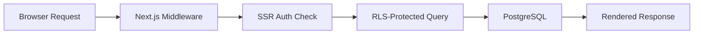
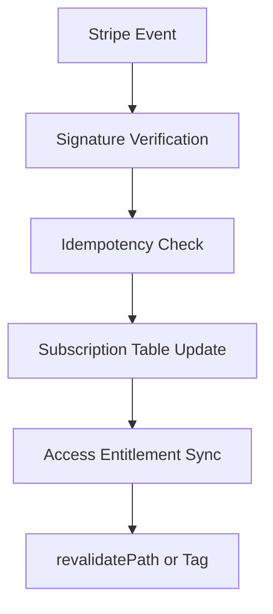
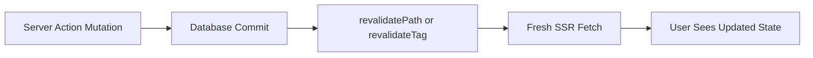

# Awesome Supabase Resources [](https://awesome.re)

[](https://github.com/mahdibrr/awesome-nextjs-supabase/actions/workflows/link-check.yml)
[](https://github.com/mahdibrr/awesome-nextjs-supabase/graphs/contributors)
[](https://github.com/mahdibrr/awesome-nextjs-supabase/commits/main)

Production-grade Next.js + Supabase architecture, debugging, scaling, RLS, Stripe, AI/RAG, and deployment engineering resources.

This is a curated production engineering hub, not a generic link dump.
It focuses on recurring failure modes in real SaaS systems and the references that actually unblock teams.

Last reviewed: 2026-05-24.
Maintained actively with changelog-backed updates.

## Contents

- [Positioning](#positioning)
- [Who This Is For](#who-this-is-for)
- [What You Can Build](#what-you-can-build)
- [Navigation](#navigation)
- [Frequently Searched Problems](#frequently-searched-problems)
- [Best Production Guides](#best-production-guides)
- [Production SaaS Stack](#production-saas-stack)
- [Reference Assets](#reference-assets)
- [Production Flows](#production-flows)
- [Curated Resources](#curated-resources)
- [Curation Standards](#curation-standards)
- [Trust Signals](#trust-signals)
- [Community](#community)

## Positioning

Most resources stop at "it works on localhost."
This repository focuses on what breaks after deployment:

- Supabase empty array results from RLS policy mistakes.
- Session loss in App Router SSR boundaries.
- Middleware auth redirect loops.
- Stripe webhook reliability and idempotency failures.
- Cache invalidation bugs after Server Actions.
- Migration safety under live traffic.

The differentiator is production operational guidance plus curated references.

## Who This Is For

- Engineers shipping Next.js + Supabase SaaS products in production.
- Teams debugging auth, RLS, billing, and cache invalidation incidents.
- Founders and maintainers who need a reliable architecture baseline.
- Developer advocates and educators collecting senior-grade references.

## What You Can Build

- Multi-tenant SaaS with Supabase RLS and Stripe subscriptions.
- AI features with pgvector/RAG and operational guardrails.
- Webhook-driven workflows with retry and idempotency safety.
- Deployable pipelines with migrations, observability, and CI/CD checks.

## Navigation

| Area                                         | Entry Point                                                      |
| -------------------------------------------- | ---------------------------------------------------------------- |
| Production incidents and symptom-first fixes | [Production Incident Index](content/incidents/README.md)         |
| Practical debugging workflows                | [Debugging Playbook](content/debugging-playbook/README.md)       |
| Release safety checks                        | [Production Checklists](content/production-checklists/README.md) |
| Reusable implementation snippets             | [Snippets](content/snippets/README.md)                           |
| Starter architecture examples                | [Open Source Examples](content/open-source-examples/README.md)   |
| Community onboarding and contribution flow   | [Community Guide](docs/community.md)                             |
| Small starter tasks for contributors         | [Good First Issues](GOOD_FIRST_ISSUES.md)                        |
| Missing high-value resources backlog         | [Resource Requests](RESOURCE_REQUESTS.md)                        |
| Curation and submission posture              | [Awesome Submission Notes](AWESOME_SUBMISSION_NOTES.md)          |
| Change history and maintenance cadence       | [Changelog](CHANGELOG.md)                                        |

## Frequently Searched Problems

| Search Phrase                | Start Here                    | First Diagnostic Check                                          |
| ---------------------------- | ----------------------------- | --------------------------------------------------------------- |
| Supabase RLS guide           | Database, RLS, and PostgreSQL | Validate policy operation and `auth.uid()` context.             |
| Supabase empty array fix     | Production Incident Index     | Confirm no `service_role` leakage and `select` policy coverage. |
| RLS policy debugging         | Production Incident Index     | Check `using` and `with check` symmetry for updates.            |
| Supabase SSR auth            | Authentication and Sessions   | Verify server cookie refresh and SSR user resolution.           |
| Supabase auth App Router     | Authentication and Sessions   | Confirm callback URLs and middleware exclusions.                |
| Next.js middleware auth      | Production Debugging          | Inspect matcher scope for `/login` and `/auth/callback`.        |
| Next.js production debugging | Production Debugging          | Inspect logs, cookies, env vars, and cache state together.      |
| Next.js Supabase SaaS        | SaaS Architecture             | Confirm tenant isolation, billing sync, and migration safety.   |
| Stripe Supabase SaaS         | Stripe and Billing            | Verify signature, idempotency, and subscription row sync.       |

## Best Production Guides

Senior-engineer references worth bookmarking:

- [Zero-Downtime Migration Strategies for Next.js and Supabase](https://www.iloveblogs.blog/guides/nextjs-supabase-migration-strategies) - Rollout sequencing, rollback planning, and migration safety under real traffic.
- [Supabase Auth and Middleware Session Management](https://www.iloveblogs.blog/guides/supabase-auth-complete-session-middleware-guide) - App Router session boundaries, cookie refresh flow, and middleware pitfalls.
- [Next.js and Supabase Stripe Subscriptions Guide](https://www.iloveblogs.blog/guides/nextjs-supabase-stripe-subscriptions-guide) - Subscription synchronization, webhook event flow, and access gating.
- [Advanced Caching Strategies for Next.js and Supabase](https://www.iloveblogs.blog/guides/nextjs-supabase-caching-strategies) - Revalidation strategy, stale-data risks, and caching tradeoffs.
- [Mastering Supabase pgvector for Semantic Search in Next.js](https://www.iloveblogs.blog/guides/nextjs-supabase-pgvector-advanced-search) - RAG architecture patterns with production constraints.
- [Next.js Server Actions vs API Routes](https://www.iloveblogs.blog/post/nextjs-server-actions-vs-api-routes) - Operational tradeoffs for mutation paths in production systems.

## Production SaaS Stack

| Layer                  | Typical Choice                           | What It Solves In Production                                        |
| ---------------------- | ---------------------------------------- | ------------------------------------------------------------------- |
| Frontend and rendering | Next.js App Router                       | SSR boundaries, route-level caching, and controlled mutation paths. |
| Auth and sessions      | Supabase Auth + SSR package              | Cookie-based sessions for Server Components and protected routes.   |
| Authorization          | Supabase RLS on PostgreSQL               | Tenant-safe access control at the data layer.                       |
| Billing                | Stripe Billing + webhooks                | Entitlements and subscription lifecycle events.                     |
| Async and workflows    | Supabase Edge Functions + queues         | Background jobs, retries, and side-effect isolation.                |
| AI and search          | pgvector + RAG pipeline                  | Semantic retrieval with controlled indexing and refresh strategy.   |
| Observability          | Sentry + runtime logs + synthetic checks | Error tracing, incident triage, and release confidence.             |
| Rate limiting          | Edge/runtime middleware + policy checks  | Abuse control and API cost stability.                               |
| CI/CD and migrations   | GitHub Actions + migration scripts       | Safe deploy sequencing and schema change discipline.                |

## Reference Assets

| Asset Type                     | Where                     |
| ------------------------------ | ------------------------- |
| Incident catalog               | Production Incident Index |
| Debugging checklists           | Debugging Playbook        |
| Release checklists             | Production Checklists     |
| Implementation snippets        | Snippets                  |
| Starter templates and examples | Starter Kits              |
| Ecosystem example projects     | Open Source Examples      |

## Production Flows

### Request Lifecycle



### RLS Request Flow

```mermaid
flowchart TD
    A[Incoming User Query] --> B[JWT Claims]
    B --> C[auth.uid() Resolution]
    C --> D[Policy USING Predicate]
    D --> E[Policy WITH CHECK Predicate]
    E --> F[Allowed Rows Returned]
```

### Stripe Webhook Reliability



### Cache Invalidation Flow



## Curated Resources

### Authentication and Sessions

- [Supabase Auth Quickstart for Next.js](https://supabase.com/docs/guides/auth/quickstarts/nextjs) - Official baseline for App Router auth setup.
- [Supabase Server-Side Auth](https://supabase.com/docs/guides/auth/server-side) - Canonical SSR session and cookie guidance.
- [Supabase SSR Package](https://github.com/supabase/ssr) - Current helpers for server-bound auth flows.
- [Next.js Environment Variables](https://nextjs.org/docs/app/guides/environment-variables) - Secrets and public key boundaries.

### RLS and Security

- [Supabase Row Level Security](https://supabase.com/docs/guides/database/postgres/row-level-security) - Primary RLS reference.
- [RLS Performance and Best Practices](https://supabase.com/docs/guides/troubleshooting/rls-performance-and-best-practices-Z5Jjwv) - Policy performance and index alignment.
- [Supabase Security Suite](https://supabase.com/blog/hardening-supabase) - Platform-level hardening patterns.
- [PostgreSQL EXPLAIN](https://www.postgresql.org/docs/current/using-explain.html) - Query plan analysis for policy-heavy tables.

### Production Debugging

- [Next.js Hydration Error Guide](https://nextjs.org/docs/messages/react-hydration-error) - Root causes and framework-level fixes.
- [Supabase Troubleshooting](https://supabase.com/docs/guides/troubleshooting) - Official issue diagnosis entry point.
- [Chrome DevTools Network Panel](https://developer.chrome.com/docs/devtools/network/) - Request, cookie, and redirect inspection.
- [Vercel Runtime Logs](https://vercel.com/docs/logs/runtime) - Production route and runtime diagnostics.

### Server Actions and Revalidation

- [Next.js Server Actions](https://nextjs.org/docs/app/getting-started/mutating-data) - Mutation semantics and runtime behavior.
- [Next.js Caching and Revalidating](https://nextjs.org/docs/app/getting-started/caching-and-revalidating) - Invalidation mechanics and stale-data control.
- [Supabase Auth Redirect Not Working](https://www.iloveblogs.blog/post/supabase-auth-redirect-fix) - App Router callback edge cases in production.
- [revalidatePath Debugging Guide](https://www.iloveblogs.blog/post/nextjs-15-caching-explained) - Real-world invalidation pitfalls and fixes.

### Stripe and Billing

- [Stripe Webhooks](https://docs.stripe.com/webhooks) - Signature verification and retries.
- [Stripe Launch Checklist](https://docs.stripe.com/get-started/account/checklist) - Go-live billing readiness.
- [stripe-samples/subscription-use-cases](https://github.com/stripe-samples/subscription-use-cases) - Reference subscription implementations.
- [Vercel Subscription Payments](https://github.com/vercel/nextjs-subscription-payments) - Next.js + Supabase + Stripe integration baseline.

### SaaS Architecture and Open-Source Examples

- [SaaS Starter by Next.js](https://github.com/nextjs/saas-starter) - Production-minded starter with billing and data layer foundations.
- [Vercel with-supabase Example](https://github.com/vercel/next.js/tree/canary/examples/with-supabase) - Official integration shape.
- [makerkit/nextjs-saas-starter-kit-lite](https://github.com/makerkit/nextjs-saas-starter-kit-lite) - Maintained open-source SaaS baseline.
- [KolbySisk/next-supabase-stripe-starter](https://github.com/KolbySisk/next-supabase-stripe-starter) - Stripe-driven starter with practical SaaS structure.

### AI, RAG, and pgvector

- [Supabase AI and Vectors](https://supabase.com/docs/guides/ai) - Official vector and AI workflows.
- [supabase-community/nextjs-openai-doc-search](https://github.com/supabase-community/nextjs-openai-doc-search) - Practical RAG baseline.
- [Vercel AI Chatbot](https://github.com/vercel/chatbot) - Production-grade chat architecture reference.
- [Production RAG Guide for Next.js and Supabase](https://www.iloveblogs.blog/guides/ai-integration-nextjs-supabase) - Operational constraints for retrieval systems.

### CI/CD, Migrations, and Deployment

- [Supabase Database Migrations](https://supabase.com/docs/guides/local-development/overview) - Migration workflow baseline.
- [Generating TypeScript Types](https://supabase.com/docs/guides/api/rest/generating-types) - Schema-to-types safety.
- [GitHub Actions](https://docs.github.com/en/actions) - CI automation backbone.
- [Vercel Next.js Deployment](https://vercel.com/docs/frameworks/nextjs) - Runtime and deploy behavior details.

### Observability and Performance

- [Sentry for Next.js](https://docs.sentry.io/platforms/javascript/guides/nextjs/) - Error monitoring and release correlation.
- [Sentry Tracing](https://docs.sentry.io/platforms/javascript/guides/nextjs/tracing/) - End-to-end latency diagnostics.
- [Checkly](https://www.checklyhq.com/docs/) - Synthetic monitoring for auth and checkout paths.
- [Lighthouse CI](https://github.com/GoogleChrome/lighthouse-ci) - Performance regression detection in CI.

## Curation Standards

- No low-effort list spam.
- No abandoned repos without clear warning.
- No duplicate links unless they solve different production problems.
- No tutorial-only resources without production applicability.
- No keyword stuffing in descriptions.

Resources are selected for operational value, not volume.

## Trust Signals

| Signal              | Evidence                                                           |
| ------------------- | ------------------------------------------------------------------ |
| Maintained actively | Last Commit badge and changelog-backed updates.                    |
| Link quality        | Link Check workflow is active on this repository.                  |
| Contributor path    | Contributing guide plus issue templates and onboarding docs.       |
| Curation philosophy | Awesome submission notes and explicit review criteria are present. |

## Community

| Project Area                                                                      | Use It For                                                          |
| --------------------------------------------------------------------------------- | ------------------------------------------------------------------- |
| [GitHub Issues](https://github.com/mahdibrr/awesome-nextjs-supabase/issues)       | Report broken resources, incidents, or curation gaps.               |
| [GitHub Pull Requests](https://github.com/mahdibrr/awesome-nextjs-supabase/pulls) | Submit curated additions and targeted fixes.                        |
| [Supabase Discussions](https://github.com/orgs/supabase/discussions)              | Platform-specific production patterns and edge cases.               |
| [Next.js Discussions](https://github.com/vercel/next.js/discussions)              | Framework behavior, routing, caching, and Server Actions questions. |

Help is most needed in RLS incidents, deployment failures, Stripe reliability, Auth edge cases, and monitoring references.

## Contributing

Pull requests are welcome.
Use the contributing guide for format and quality requirements.

This repository is an independent community resource and is not affiliated with Vercel, Next.js, Supabase, or Stripe.
