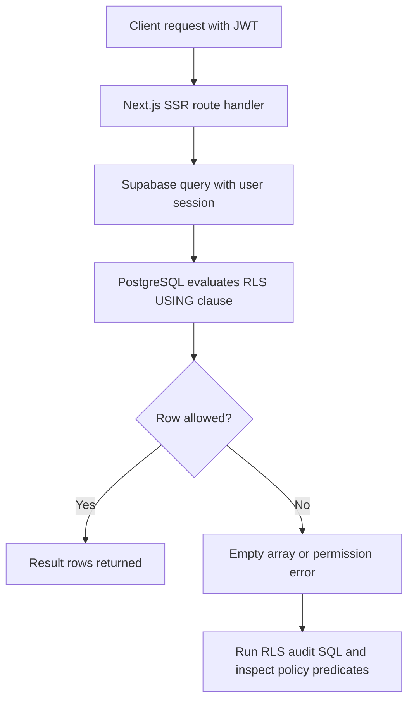

# RLS Request Flow: Problem -> Fix -> Production Guide

## Verification Steps

1. Re-run the failing query with a real authenticated token.
2. Confirm policy predicates include tenant/user scope.
3. Run `EXPLAIN ANALYZE` for policy-heavy queries.
4. Validate no client code uses `service_role` credentials.
