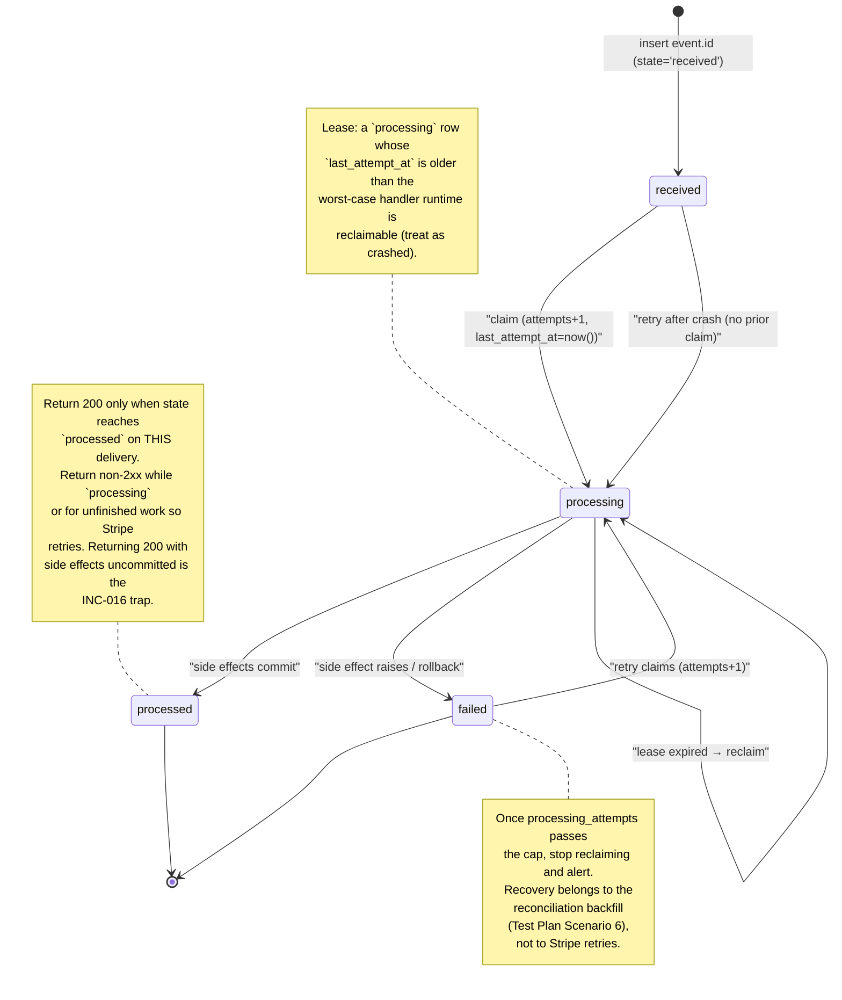
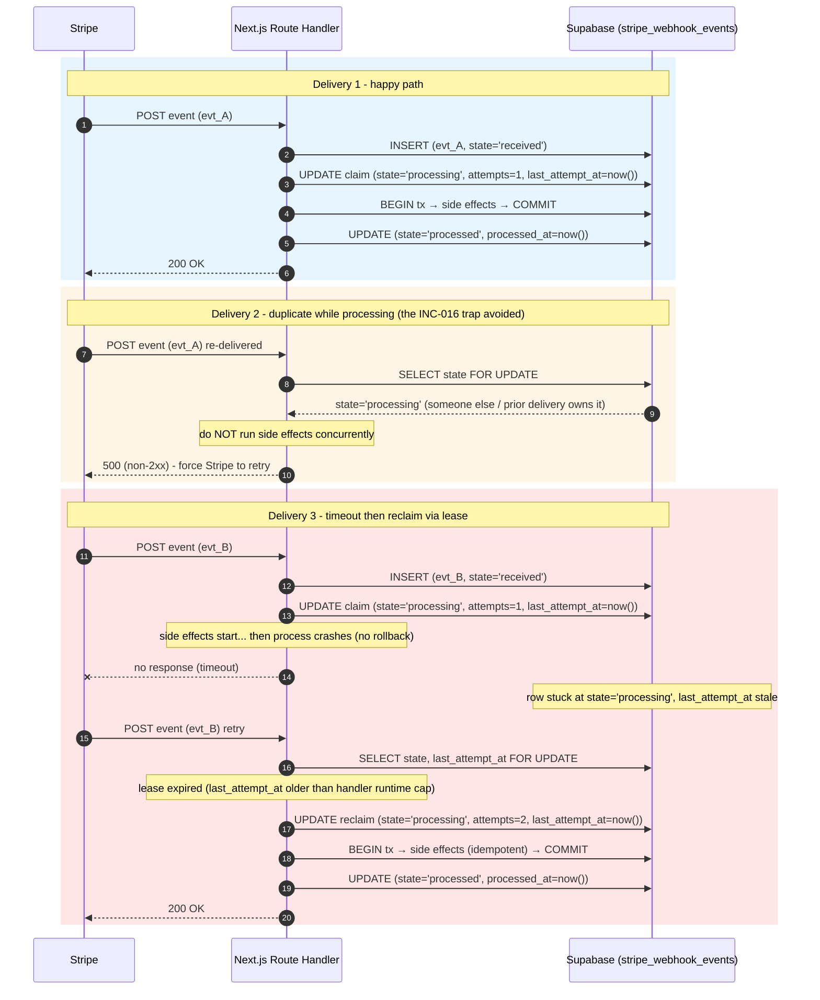

# Stripe Webhook Retry & Idempotency State Machine

Last verified: 2026-07-19

Companion to [INC-016](../incident-index/README.md): the failure mode where a webhook handler returns `200 OK` on a single delivery but the business side effects never committed (or committed twice on retry). The state machine below is the one defined in [`../templates/stripe-webhook-idempotency-template.sql`](../templates/stripe-webhook-idempotency-template.sql) (`received -> processing -> processed | failed`, with `processing_attempts` and `last_attempt_at`) and exercised by Scenarios 1-4 of [`../playbooks/stripe-webhook-test-plan.md`](../playbooks/stripe-webhook-test-plan.md). Every state name and transition here is pinned to those two files; no extra states were invented.

## State machine

## Three deliveries against the same handler

## Notes

- The state machine has exactly four states (`received`, `processing`, `processed`, `failed`) — matching the `CHECK` constraint in the SQL template. No diagram-only states were added.
- The claim step guards concurrency: `WHERE state IN ('received', 'failed') ... RETURNING id`. If `RETURNING` is empty, the caller must not run side effects (Delivery 2 above).
- Lease reclaim is not a new state; it is the `processing -> processing` self-loop driven by `last_attempt_at`, not a schema change.
- Side-effect idempotency (unique on `(stripe_event_id, side_effect_name)`) lives in the business tables, not in `stripe_webhook_events` — see the SQL template's closing note. The diagram assumes those constraints exist; otherwise re-execution is not safe.