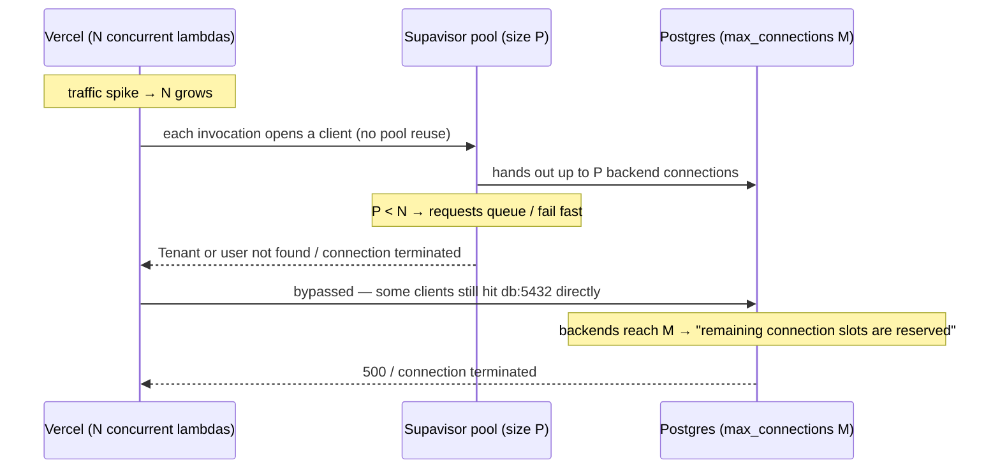

# INC-017: Vercel serverless / Supavisor Postgres connection pool exhaustion

Last verified: 2026-07-19
Pinned to: Supabase Postgres + Supavisor (transaction-mode pooler on port `6543`, session/direct on `5432`) fronted by Next.js Route Handlers / Server Actions running on Vercel Functions (Fluid Compute). Behavior is the same for any serverless runtime (Lambda, Netlify) hitting Supabase Postgres.

## Symptom

At low traffic everything is fine. The moment concurrency rises — a traffic spike, a Vercel deploy fanning out many concurrent serverless invocations, or a single slow query holding a connection — data routes start throwing:

```
remaining connection slots are reserved for non-replication superuser connections
```

```
connection terminated
```

```
Tenant or user not found   (Supavisor — its pool is saturated and it rejects new tenants)
```

HTTP 500/502 spikes on every route that touches the database. The app heals on its own when traffic drops, then breaks again on the next spike. `pg_stat_activity` shows connections climbing to `max_connections` and staying there.

### Timeline (the shape of the incident)



## Impact

Total outage of every data route under load, with full self-healing the moment concurrency drops below the pool size — which makes it trivially reproducible in staging with a load test and trivially missable in pre-launch manual QA (one user, one tab, never hits the limit). Trust damage is high because the failure mode is "the app works perfectly until it doesn't," and rollbacks do nothing (the bad behavior is in the connection topology, not the code that was just deployed — though a deploy that spikes concurrency is a common trigger).

## Root cause — five distinct causes, each with a minimal repro

### Cause 1 — Each serverless invocation opens a new Postgres connection; no pooled endpoint

The default "just connect to Postgres" path uses the **direct** string (`db.<ref>.supabase.co:5432`). Every serverless function instance is a fresh process; if it opens a TCP connection to Postgres, that is one of the DB's `max_connections` slots gone for the lifetime of that invocation. Vercel can spin up dozens-to-hundreds of concurrent instances on a traffic spike. Postgres' default `max_connections` on Supabase ranges by compute size (small computes: ~60–200; the free plan's pooler cap is 200). You exhaust the DB before you exhaust the function.

Repro:

```ts
// app/api/posts/route.ts
import { Pool } from 'pg'

// Direct connection string (port 5432) + module-scope pool, but each new
// serverless instance creates its own pool → N instances × max pool size connections.
const pool = new Pool({ connectionString: process.env.DIRECT_URL, max: 10 })

export async function GET() {
  const { rows } = await pool.query('select * from posts limit 10')
  return Response.json(rows)
}
```

At 50 concurrent lambdas × `max: 10`, that is 500 client connections against a DB that allows far fewer. Postgres refuses with `remaining connection slots are reserved for non-replication superuser connections`.

### Cause 2 — Supavisor pool size vs. serverless fan-out: default pool too small

Even with the **pooler** string (`…pooler.supabase.com:6543`, transaction mode), Supavisor has a per-project pool sized against your compute add-on. The default is conservative. If peak concurrent serverless invocations exceed the pool, Supavisor queues or rejects — you see `Tenant or user not found` and `connection terminated` instead of the Postgres error, but the user-facing symptom (HTTP 500 on data routes) is identical. Supabase's guidance: if you use PostgREST heavily, cap the pool at ~40% of `max_connections`; otherwise you can commit up to ~80%, leaving room for Auth, Storage, and internal services.

Repro: same Route Handler as Cause 1, but `DATABASE_URL` points at `…pooler.supabase.com:6543` with the default pool size. Run a k6 load test (below) at 200 RPS — requests start failing once concurrent invocations exceed the configured pool size.

### Cause 3 — Module-scope DB clients that leak on freeze/reuse

A pool created in module scope is the standard recommendation — **but** a serverless function can be frozen between invocations and a new instance spun up next to it. If connections are not explicitly released, and the frozen instance never closes its sockets, you get "phantom" connections: idle timeout timers do not fire while the function is suspended, so the socket stays open against Supavisor/Postgres but is never reused. Each deploy also spawns a fresh fleet, and the old fleet's connections linger until the platform reaps them. Vercel documents this exact failure mode.

Repro:

```ts
// lib/db.ts
import postgres from 'postgres'

// Module-scope client. Correct for reuse. BUT: no idle timeout, no cleanup on
// suspension → frozen instances keep sockets open against Supavisor.
export const sql = postgres(process.env.DATABASE_URL!, { max: 10 })
```

Deploy under load, then watch `pg_stat_activity` (or the Supavisor `supavisor_pool_connections_checked_out` metric) climb and never come back down after traffic subsides.

### Cause 4 — PgBouncer/Supavisor transaction-mode limitations break ORMs

Transaction mode (port `6543`) multiplexes a backend across many clients per transaction. It does **not** support named prepared statements, `SET` session statements, advisory locks, `LISTEN/NOTIFY`, or temp tables that span transactions. Prisma and Drizzle both use prepared statements by default; with the transaction pooler they throw:

```
Error: prepared statement "s0" already exists
```

```
prepared statement "drizzle_s_1" does not exist
```

These errors are *load-dependent*: at low concurrency the prepared statement cache hits a free backend and works; under load the statement gets bound to a backend that a different client then reuses, and the error fires. So the same deploy looks green in manual QA and red in production.

Repro (Drizzle):

```ts
// lib/db.ts
import { drizzle } from 'drizzle-orm/postgres-js'
import postgres from 'postgres'

// WRONG: prepare defaults to true → breaks under Supavisor transaction mode
export const db = drizzle(postgres(process.env.DATABASE_URL!))
```

Repro (Prisma) — missing `?pgbouncer=true`:

```env
# WRONG: no pgbouncer=true → Prisma issues prepared statements that Supavisor
# transaction mode cannot route.
DATABASE_URL="postgresql://postgres.<ref>:<pw>@aws-0-<region>.pooler.supabase.com:6543/postgres"
```

### Cause 5 — Direct (session, 5432) vs pooler (transaction, 6543) connection string mixup

The two strings look similar; the only difference is host and port. Swap them and you get the worst of both worlds:

- **App uses the direct string (`db.<ref>.supabase.co:5432`)** → Cause 1 (connection exhaustion under fan-out).
- **Migrations use the pooler string (`…pooler.supabase.com:6543`)** → migration commands hang or fail silently because `CREATE INDEX CONCURRENTLY`, `SET session_replication_role`, and `prisma migrate deploy` need a session, not a multiplexed transaction. Drizzle Kit and Prisma Migrate both require the direct connection.

The 2025-02-28 Supabase change made this stricter: session mode on port 6543 was deprecated; 6543 is transaction-only, 5432 is session/direct-only. Strings that used to work broke silently.

Repro (Prisma with both URLs swapped):

```env
# WRONG — app should use the pooler, migrations should use the direct.
DATABASE_URL="postgresql://postgres.<ref>:<pw>@db.<ref>.supabase.co:5432/postgres"   # app exhausts DB
DIRECT_URL="postgresql://postgres.<ref>:<pw>@aws-0-<region>.pooler.supabase.com:6543/postgres"  # migrations hang
```

## Detection (run these now)

### Query 1 — Live connections vs. `max_connections`

```sql
show max_connections;

select
  state,
  usename,
  application_name,
  count(*) as n
from pg_stat_activity
where datname = current_database()
group by state, usename, application_name
order by n desc;
```

- **Expected (healthy):** total active+idle backends comfortably below `max_connections` (e.g. < 60% at peak), stable after traffic subsides.
- **Actual (incident):** total backends sit at or near `max_connections`; the breakdown shows many `idle` connections from your app's role that never close — that is the leak (Cause 3). If the count is dominated by `supabase_admin` / `authenticator` / `supabase_auth_admin`, the load is internal services, not your app — adjust pool size accordingly.

### Query 2 — Connections by source IP / role (find the leaker)

```sql
select
  client_addr,
  usename,
  application_name,
  count(*) filter (where state = 'idle')              as idle,
  count(*) filter (where state = 'active')            as active,
  count(*) filter (where state = 'idle in transaction') as idle_in_txn,
  count(*) as total
from pg_stat_activity
where datname = current_database()
  and backend_type = 'client backend'
group by client_addr, usename, application_name
order by total desc;
```

- **Expected (healthy):** a small number of IPs (your pooler's egress + a few direct clients), `idle_in_txn` = 0.
- **Actual (incident):** many distinct client IPs (each a Vercel function instance hitting the direct string), or one IP with hundreds of `idle` connections that never close (frozen lambdas, Cause 3). `idle in transaction` > 0 means a transaction was opened and never committed/rolled back — a code bug, not a pool-sizing bug.

### Query 3 — Long-running queries holding connections

```sql
select
  pid,
  usename,
  application_name,
  state,
  now() - query_start    as query_duration,
  now() - xact_start     as txn_duration,
  left(query, 120)       as query
from pg_stat_activity
where datname = current_database()
  and state <> 'idle'
  and pid <> pg_backend_pid()
order by txn_duration desc nulls last
limit 20;
```

- **Expected (healthy):** query and txn durations in the millisecond-to-low-second range.
- **Actual (incident):** one or two queries with `txn_duration` in the minutes — that is a single slow query pinning a backend while the pool starves (the trigger condition for Cause 1/2). Fix the query; do not just add pool size.

### Query 4 — Distinguish "pool exhausted" from "DB CPU bound"

```sql
-- CPU-bound DB: active queries pile up, but connection count is low.
select
  count(*) filter (where state = 'active')             as active,
  count(*) filter (where state = 'idle')               as idle,
  count(*) filter (where wait_event_type = 'IO')       as waiting_on_io,
  count(*) filter (where wait_event_type = 'Lock')     as waiting_on_lock
from pg_stat_activity
where datname = current_database();
```

- If `active` is high and `wait_event_type = 'IO'`/`'Lock'` is high while `idle` is low → DB is CPU/IO bound, not pool-starved. Adding pool size will not help; tune the query or scale the compute.
- If `idle` is high and `active` is low but the app still errors → connections are leaking (Cause 3), not being worked.

### Query 5 — Supavisor pool metrics (Prometheus endpoint)

Supavisor exposes per-tenant gauges — use them instead of guessing from `pg_stat_activity`:

- `supavisor_pool_connections_checked_out` — busy/active connections
- `supavisor_pool_connections_idle` — idle connections in the pool

If `checked_out` is pinned at your configured pool size, the pool is the bottleneck (Cause 2). Scale the pool or reduce concurrency. If `idle` is high but `checked_out` is low and the app still errors, you are leaking clients (Cause 3).

### Minimal repro — k6 load test against one data route

```bash
# k6 script: load-test a single /api/posts route
cat > /tmp/load.js <<'EOF'
import http from 'k6/http'
export const options = { vus: 100, duration: '60s' }
export default function () {
  http.get(`${__ENV.BASE}/api/posts`)
}
EOF

BASE=https://your-app.vercel.app k6 run /tmp/load.js
```

- **Healthy:** < 1% errors, p95 latency stable, `pg_stat_activity` plateaus below `max_connections`.
- **Incident:** error rate spikes after VUs exceed the pool size; latency has a long tail of timeouts. The error rate curve (knees at the pool size boundary) tells you it is Cause 1/2, not CPU.

## Fix

### 1. Use the right connection string for the right job

| String | Port | Mode | Use for |
| --- | --- | --- | --- |
| `db.<ref>.supabase.co:5432` | 5432 | Direct / session | Migrations, `pg_dump`, long-lived backends, `prisma migrate deploy`, `drizzle-kit` |
| `aws-<region>.pooler.supabase.com:5432` | 5432 | Session pooler | IPv4-only persistent backends that need session features |
| `aws-<region>.pooler.supabase.com:6543` | 6543 | **Transaction pooler** | **Serverless / edge / per-request workloads (your Vercel app)** |

```env
# Runtime — transaction pooler (Vercel Functions)
DATABASE_URL="postgresql://postgres.<ref>:<pw>@aws-0-<region>.pooler.supabase.com:6543/postgres"

# Migrations — direct connection (drizzle-kit, prisma migrate)
DIRECT_URL="postgresql://postgres.<ref>:<pw>@db.<ref>.supabase.co:5432/postgres"
```

### 2. Disable prepared statements in your ORM (transaction mode)

Drizzle (postgres-js driver):

```ts
// lib/db.ts
import { drizzle } from 'drizzle-orm/postgres-js'
import postgres from 'postgres'

const client = postgres(process.env.DATABASE_URL!, {
  prepare: false,          // REQUIRED for Supavisor transaction mode (port 6543)
  max: 1,                  // one backend per serverless instance — Vercel Fluid Compute reuses it
  idle_timeout: 5,         // seconds — close fast on suspension
  connect_timeout: 10,
})

export const db = drizzle(client)
```

Prisma — append `?pgbouncer=true` and use a driver adapter:

```env
# Pooled — Prisma Client at runtime
DATABASE_URL="postgresql://postgres.<ref>:<pw>@aws-0-<region>.pooler.supabase.com:6543/postgres?pgbouncer=true"

# Direct — Prisma CLI for migrations
DIRECT_URL="postgresql://postgres.<ref>:<pw>@db.<ref>.supabase.co:5432/postgres"
```

```ts
// lib/prisma.ts
import { PrismaClient } from './generated/prisma/client'
import { PrismaPg } from '@prisma/adapter-pg'

const adapter = new PrismaPg({ connectionString: process.env.DATABASE_URL })
export const prisma = new PrismaClient({ adapter })
```

> Note: `pgbouncer=true` disables prepared statements and `SET search_path` in Prisma. On PgBouncer ≥ 1.21.0 with `max_prepared_statements > 0` you can drop `pgbouncer=true`, but Supavisor's transaction mode still needs it unless you have explicitly confirmed prepared-statement support. When in doubt, leave it on.

### 3. Stop leaking connections on suspension (Vercel Fluid Compute)

Use `attachDatabasePool` from `@vercel/functions` so idle connections close before the function is suspended — this is the documented fix for the "phantom connection" failure mode (Cause 3):

```ts
// app/api/posts/route.ts
import { attachDatabasePool } from '@vercel/functions'
import { Pool } from 'pg'

const pool = new Pool({
  connectionString: process.env.DATABASE_URL,
  max: 1,
  idleTimeoutMillis: 5000,
})

// Fluid Compute: closes idle connections before the function is frozen.
attachDatabasePool(pool)

export async function GET() {
  const { rows } = await pool.query('select * from posts limit 10')
  return Response.json(rows)
}
```

Rules:
- Define the pool **globally** (module scope) so concurrent requests reuse it.
- Set `idleTimeoutMillis` to ~5s so sockets close fast.
- Do **not** set `max: 1` on a pool you expect to fan out — keep `min: 1`, raise `max` only as your backend budget allows.
- Use **rolling releases** so a new deploy drains the old fleet gradually instead of suspending every old instance at once (which leaks all their connections simultaneously).

### 4. Size the pool against `max_connections`, not against hoped-for traffic

In the Supabase dashboard (Database Settings → Connection Pooling), set the Supavisor pool size using the documented rules:

- Heavy PostgREST usage → cap pool at ~40% of `max_connections`.
- Otherwise → up to ~80%, reserving headroom for Auth, Storage, and internal services.
- If `pg_stat_activity` shows you only ever use 80 of 500 connections, you can commit ~420 minus a buffer to the pool.

### 5. Retry/backoff on transient connection errors

Even with correct sizing, a deploy spike can momentarily exhaust the pool. Wrap data-route queries in a short retry with exponential backoff and jitter so a transient `connection terminated` does not become a 500:

```ts
async function withRetry<T>(fn: () => Promise<T>, attempts = 3): Promise<T> {
  for (let i = 0; i < attempts; i++) {
    try {
      return await fn()
    } catch (err) {
      if (i === attempts - 1) throw err
      const msg = String(err?.message ?? err)
      if (!/connection terminated|Tenant or user not found|remaining connection slots/i.test(msg)) throw err
      await new Promise(r => setTimeout(r, 50 * 2 ** i + Math.random() * 50))
    }
  }
  throw new Error('unreachable')
}
```

### 6. When to move off the shared pooler

If you have outgrown the shared Supavisor pool (saturated at your compute tier under real load), the move is to the **Dedicated Pooler (PgBouncer)** on paid tiers — co-located with the DB for lower latency and a pool size you fully control. The dedicated pooler endpoint is `db.<ref>.supabase.co:6543` on paid plans. Temjo benchmarks cited by Supabase show PgBouncer ~2× the TPS of the shared Supavisor because it skips the cross-server hop.

## Prevention

### CI gate — fail the build if a data route opens more than N connections under load

Wire k6 (or artillery) into CI against the preview deployment. The gate fails if either:
- error rate > 1% at 100 VUs for 60s, or
- peak concurrent Postgres connections > a budget you set (e.g. 60% of `max_connections`).

```yaml
# .github/workflows/load-test.yml
name: load-test
on: pull_request
jobs:
  k6:
    runs-on: ubuntu-latest
    steps:
      - uses: actions/checkout@v4
      - run: echo "BASE=${{ secrets.PREVIEW_URL }}" >> $GITHUB_ENV
      - uses: grafana/k6-action@v0.3.1
        with:
          filename: ./tests/load/data-route.js
          flags: --vus 100 --duration 60s
      - name: fail-on-errors
        run: |
          # k6 exits non-zero on threshold breach if you set thresholds in the script.
          # Alternative: query pg_stat_activity peak via the metrics API and compare to budget.
```

```js
// tests/load/data-route.js
import http from 'k6/http'
import { check } from 'k6'

export const options = {
  vus: 100,
  duration: '60s',
  thresholds: {
    http_req_failed: ['rate<0.01'],     // < 1% errors
    http_req_duration: ['p(95)<500'],   // p95 < 500ms
  },
}

export default function () {
  const res = http.get(`${__ENV.BASE}/api/posts`)
  check(res, { 'status 200': r => r.status === 200 })
}
```

### Alert on connection count

Alert when active+idle backends exceed 60% of `max_connections` sustained for 5 minutes. Use the Supabase Grafana dashboard (200+ metrics, includes Client Connections for both Supavisor and Postgres) or scrape the Supabase metrics endpoint:

```
https://<project-ref>.supabase.co/customer/v1/privileged/metrics
```

Alert rules:
- `sum(supavisor_pool_connections_checked_out) / pool_size > 0.8` for 5m → page (pool saturation, Cause 2).
- `pg_stat_activity_count / max_connections > 0.6` for 5m → page (DB saturation, Cause 1).
- `idle in transaction` count > 0 for 10m → ticket (leaked transaction, Cause 3 cousin).

### Cap concurrency at the platform

On Vercel, set `maxDuration` and concurrency caps per route, and prefer **rolling releases** over instant cutover so a deploy does not spawn a fresh fleet that doubles your connection footprint during the switchover.

### Code review checklist

Add to your PR template:
- "Does the data route use the transaction pooler (`…pooler.supabase.com:6543`)?"
- "If Prisma: is `?pgbouncer=true` set on `DATABASE_URL` and is `DIRECT_URL` the direct string for migrations?"
- "If Drizzle: is `prepare: false` set on the client?"
- "Is the pool/client created in module scope with an `idle_timeout` of ~5s?"
- "On Vercel Fluid Compute: is `attachDatabasePool` called so connections close before suspension?"
- "Does the route retry transient `connection terminated` with backoff?"

Only mark the incident resolved when a 100-VU 60s k6 run against preview shows < 1% errors and `pg_stat_activity` plateaus below 60% of `max_connections`.

## References

- Supabase — connecting to Postgres (direct vs. pooler, ports 5432/6543, transaction vs. session mode): https://supabase.com/docs/guides/database/connecting-to-postgres
- Supabase — connection management (pool size vs. `max_connections`, `pg_stat_activity` monitoring, dashboard charts): https://supabase.com/docs/guides/database/connection-management
- Supabase — Supavisor (pooler architecture, per-tenant pool sizing, Prometheus `/metrics`): https://supabase.com/docs/guides/database/supavisor
- Supabase — Drizzle guide (transaction pooler requires `prepare: false`): https://supabase.com/docs/guides/database/drizzle
- Drizzle ORM — get started with Supabase (turn off `prepare` for Transaction pool mode): https://orm.drizzle.team/docs/get-started/supabase-new
- Supabase — Prisma guide (`pgbouncer=true` on `DATABASE_URL`, `DIRECT_URL` for migrations): https://supabase.com/docs/guides/database/prisma
- Prisma — configure Prisma Client with PgBouncer (`pgbouncer=true`, prepared statements, `max_prepared_statements` on 1.21.0+): https://www.prisma.io/docs/orm/prisma-client/setup-and-configuration/databases-connections/pgbouncer
- Vercel — connection pooling with Vercel Functions (`attachDatabasePool`, idle timeout, Fluid Compute reuse): https://vercel.com/kb/guide/connection-pooling-with-functions
- Vercel — efficiently manage database connection pools with Fluid Compute: https://vercel.com/kb/guide/efficiently-manage-database-connection-pools-with-fluid-compute
- Vercel — the real serverless compute-to-database connection problem (connection leaks on suspension, Supabase free plan 200-connection cap, rolling releases): https://vercel.com/blog/the-real-serverless-compute-to-database-connection-problem-solved
- Vercel — Functions limits (1,024 file descriptors shared across concurrent executions): https://vercel.com/docs/functions/limitations
- PostgreSQL — `pg_stat_activity` and the cumulative statistics system: https://www.postgresql.org/docs/17/monitoring-stats.html