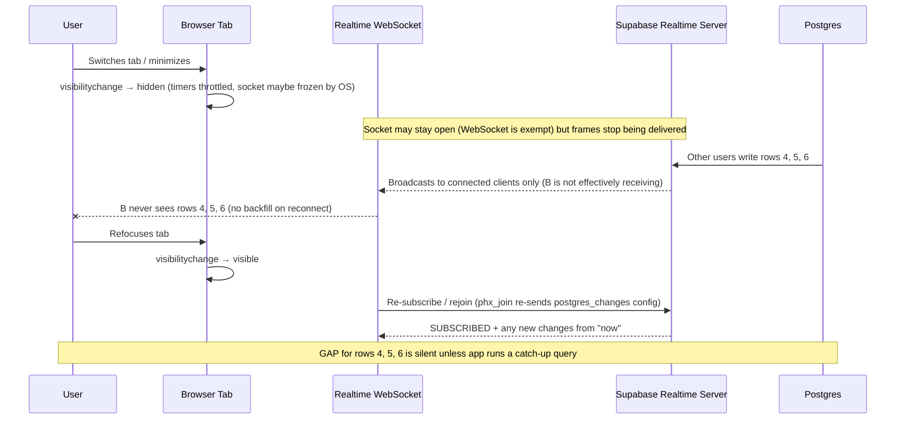

# INC-019: Supabase Realtime stale / missing / duplicated updates after browser tab suspension

Last verified: 2026-07-19
Pinned to: Supabase Realtime (Phoenix Channels over WebSocket), `postgres_changes` channel, browser background-tab throttling as documented by Chrome/Chromium and MDN. Realtime is a **live stream**, not a durable log — it does not buffer or replay changes that occur while a client is disconnected. That single fact is the root of every symptom below.

## Symptom

A live dashboard or collaborative UI built on `supabase.channel(...).on('postgres_changes', ...)` works perfectly while the tab is focused. The user switches tabs, minimizes the browser, or locks their phone. They come back minutes later and see one of:

1. **Stale data** — rows that other users inserted/updated during the backgrounded window are missing. The UI looks "frozen" at the state it had when the tab was hidden.
2. **A burst of duplicates** — on refocus, several old changes arrive at once and the app appends them again, producing duplicate rows in lists/feeds that are keyed by array index instead of primary key.
3. **Silently lost updates** — changes that other users made while the tab was backgrounded never arrive at all, and the app has no idea anything was missed. A manual refresh "fixes" it.

Mobile + battery saver makes all three worse. Refreshing the page always fixes it — which is exactly why this bug hides in production: developers never reproduce it because they keep the dev tab focused.

## Impact

Silent data divergence. No error is thrown, no exception is logged, no reconnect failure surfaces — the WebSocket is often still open from the browser's perspective, so observability that watches for `CHANNEL_ERROR` / `CLOSED` stays green. Users make decisions on stale data, overwrite each other's work in collaborative UIs, or complain "my dashboard is broken" hours after the actual cause. Because the trigger is a client-side environmental condition (background tab) that does not reproduce on a focused dev machine, the bug is reported as "intermittent" and is rarely root-caused without a deliberate repro.

## Root cause — five contributing causes, each with a repro

### Cause 1 — Browser throttles/freezes timers in background tabs

Browsers throttle JavaScript timers in background tabs to save power. Chrome's budget-based throttling (since Chrome 57) gives each background tab a time budget that regenerates at 0.01 s per second; after ~10 seconds in the background, timer tasks only run when the budget is non-negative. **WebSockets themselves are exempt from this throttling** ("Applications with real-time connections (WebSockets and WebRTC), to avoid closing these connections by timeout"), but the **client-side heartbeat timers and your app's `setTimeout`/`setInterval` handlers are not exempt from the once-per-second alignment and (in Chrome 88+) intensive throttling of chained timers down to once per minute after 5 minutes hidden.** On mobile, the OS can freeze the renderer entirely, closing or suspending the socket.

Repro:

```bash
# 1. Open the dashboard in Chrome desktop, open DevTools → Network → WS.
# 2. Confirm the Realtime WS frames are flowing (filter by "realtime").
# 3. Switch to another tab and leave it for 6+ minutes (past the Chrome 88 intensive threshold).
# 4. From a second session, insert a row into the watched table.
# 5. Switch back to the dashboard tab. Observe:
#    - the new row is missing, OR
#    - a burst of frames arrives at once and the UI duplicates them.
```

### Cause 2 — Realtime does NOT backfill the gap on reconnect

This is the load-bearing fact: **Supabase Realtime is a live stream, not a durable log.** When the client disconnects (because the OS froze the socket, the network dropped, or the server killed the channel on missed heartbeats), Postgres keeps writing and the Realtime server keeps broadcasting to whoever is connected. The disconnected client receives nothing. On reconnect, Realtime starts streaming from "now" — it does not replay the changes that happened during the gap. The official Postgres Changes doc does not advertise any resume token or backfill mechanism, and community fixes confirm there is none.

Repro:

```js
// Client A — subscribe and record the last commit_timestamp seen.
let lastSeenCommitTs = null
supabase
  .channel('posts')
  .on('postgres_changes', { event: '*', schema: 'public', table: 'posts' },
    (payload) => {
      lastSeenCommitTs = payload.commit_timestamp
      applyChange(payload)
    })
  .subscribe()

// Client A goes offline (toggle network / background tab for 60s).
// Client B inserts 3 rows during that window.
// Client A reconnects → SUBSCRIBED fires, but the 3 inserts never arrive.
// lastSeenCommitTs still points at the pre-gap row. The UI is wrong.
```

### Cause 3 — Reconnect can deliver a burst that duplicates if the app doesn't dedupe

When the tab refocuses, the socket may flush queued frames or the client may rejoin the channel and immediately receive the next batch of changes. If your reducer appends by array index (or by a client-generated id) instead of upserting by primary key + `commit_timestamp`, the same logical row appears twice. This is the classic "duplicate feed items on refocus" bug.

Repro:

```js
// Buggy reducer — appends blindly, no dedupe.
function applyChange(payload) {
  // payload.new is the full row; if the server re-emits a recent row on
  // rejoin, or if a queued frame flushes, this row gets pushed again.
  state.posts.push(payload.new) // ❌ duplicates on refocus
}
```

### Cause 4 — Heartbeat / presence config mistuned

Supabase uses Phoenix Channels heartbeats internally; the server sends a heartbeat, the client must ack. Missed acks ⇒ server kills the socket; missed heartbeats ⇒ client triggers a timeout reconnect. Two failure modes:

- **Too-passive heartbeat** in a backgrounded tab: the heartbeat `setTimeout` is throttled, the server stops receiving acks, the server kills the socket, presence drops the user, and on refocus you see a flap of leave/rejoin events.
- **Too-aggressive heartbeat** keeps the tab "alive" in the scheduler (timers are firing, so the tab isn't fully idle), which burns battery on mobile without actually delivering changes (because the underlying network may still be frozen by the OS).

The Supabase JS client lets you pass a `heartbeatCallback` (to detect the first missed heartbeat instead of waiting for the SDK's 3-strike threshold) and `worker: true` (runs the WebSocket in a Web Worker, which avoids main-thread background throttling and keeps heartbeats alive when the tab is hidden). Both are documented community patterns, not in the official Realtime guide.

### Cause 5 — `visibilitychange` not handled

The app never listens for `document.visibilitychange`, so on refocus it does nothing — it trusts whatever state the (possibly-stale) Realtime stream hands it. The Page Visibility API exists precisely for this: the MDN doc recommends using it to pause work when hidden and resume/revalidate when visible. Without a `visibilitychange → visible` handler that triggers a catch-up query, the app stays stale until the user manually refreshes.



## Detection (run these now)

1. **Reproduce the gap deliberately** (this is the single most important step — it will not reproduce on a focused dev tab):

   ```bash
   # Session A: load dashboard, confirm WS frames flowing in DevTools → Network → WS.
   # Background tab A for 60s (or toggle network off for 60s to simulate mobile).
   # Session B: insert 2 rows into the watched table.
   # Refocus tab A. Observe whether the 2 rows appear.
   # If they don't → gap bug confirmed. If they appear twice → dedupe bug.
   ```

2. **Inspect WS frames in DevTools.** Filter Network by WS, select the Realtime socket, read the Frames tab. While backgrounded, you should see frames stop arriving (or the socket close/reopen). On refocus, look for the `phx_join` reply and confirm whether `postgres_changes` config is present in the rejoin payload — the `realtime-py` issue #213 documented a bug where auto-reconnect re-joined the channel **without re-sending the `postgres_changes` config**, so the server replied with `postgres_changes: []` and no DB events were delivered afterward. The JS client is not immune to this class of bug; verify your rejoin payload.

3. **Log `commit_timestamp` deltas.** Every `postgres_changes` payload includes a `commit_timestamp`. Log the gap between consecutive timestamps and between the latest seen and the client's wall clock:

   ```ts
   let lastTs: string | null = null
   supabase
     .channel('debug')
     .on('postgres_changes', { event: '*', schema: 'public', table: 'posts' },
       (payload) => {
         const ts = payload.commit_timestamp
         if (lastTs) {
           const deltaMs = new Date(ts).getTime() - new Date(lastTs).getTime()
           const lagMs = Date.now() - new Date(ts).getTime()
           if (lagMs > 5000) {
             console.warn('[realtime] stale frame', { lagMs, deltaMs, ts })
           }
         }
         lastTs = ts
       })
     .subscribe()
   ```

   A `lagMs` that jumps from ~10 ms (foreground) to minutes (after refocus) means frames were queued/delayed; a `lagMs` that stays high after refocus with no catch-up means the gap is lost, not delayed.

4. **Check whether you handle `visibilitychange` at all:**

   ```bash
   rg "visibilitychange" app/
   ```

   Zero hits ⇒ cause #5 is in play.

## Fix — the resync-on-reconnect pattern

The fix is one principle: **never trust the stream as a complete log.** Treat every (re)subscribe and every refocus as a moment to catch up by query, watermarked by the last `commit_timestamp` you successfully applied, and dedupe by primary key.

### Step 1 — Track the high-watermark

```ts
// lib/realtime.ts
type ChangePayload<T> = {
  schema: string
  table: string
  type: 'INSERT' | 'UPDATE' | 'DELETE'
  commit_timestamp: string
  old_record?: Partial<T>
  record: T
}

const pkOf = (row: any, table: string) => {
  // Adjust per table; for a single-PK table this is enough.
  const pk = 'id'
  return `${table}:${row[pk]}`
}

export class RealtimeSync<T extends { id: string; updated_at: string }> {
  private channel: ReturnType<typeof supabase.channel> | null = null
  private lastSeenCommitTs: string | null = null
  private applied = new Map<string, string>() // pk -> commit_timestamp of last applied change
  private catchUpInFlight = false

  constructor(
    private readonly table: string,
    private readonly onRows: (rows: T[]) => void,
    private readonly onChange: (payload: ChangePayload<T>) => void,
  ) {}

  // Merge a payload, deduping by PK + commit_timestamp.
  private apply(payload: ChangePayload<T>, dedupe = true) {
    const key = pkOf(payload.record, this.table)
    if (dedupe && this.applied.get(key) === payload.commit_timestamp) {
      return // already applied — drop the duplicate
    }
    this.applied.set(key, payload.commit_timestamp)
    if (this.lastSeenCommitTs === null ||
        new Date(payload.commit_timestamp) > new Date(this.lastSeenCommitTs)) {
      this.lastSeenCommitTs = payload.commit_timestamp
    }
    this.onChange(payload)
  }

  // Backfill any rows changed since the last seen commit timestamp.
  private async catchUp() {
    if (this.catchUpInFlight) return
    this.catchUpInFlight = true
    try {
      let query = supabase.from(this.table).select('*')
      if (this.lastSeenCommitTs) {
        // updated_at must be kept in sync with commit_timestamp (trigger-stamped).
        query = query.gt('updated_at', this.lastSeenCommitTs).order('updated_at', { ascending: true })
      }
      const { data, error } = await query
      if (error) throw error
      if (data && data.length) {
        this.onRows(data as T[])
        // Advance watermark to the newest row we just merged.
        const maxTs = data.reduce((m, r) => r.updated_at > m ? r.updated_at : m, this.lastSeenCommitTs ?? '')
        if (maxTs) this.lastSeenCommitTs = maxTs
      }
    } finally {
      this.catchUpInFlight = false
    }
  }

  subscribe() {
    // Tear down any previous channel before creating a new one (avoid duplicate events).
    if (this.channel) {
      supabase.removeChannel(this.channel)
    }
    // Unique channel name per attempt prevents phx_join races on rapid reconnect.
    this.channel = supabase
      .channel(`${this.table}-${Date.now()}`)
      .on('postgres_changes',
        { event: '*', schema: 'public', table: this.table },
        (payload: ChangePayload<T>) => this.apply(payload))
      .subscribe(async (status) => {
        if (status === 'SUBSCRIBED') {
          // The stream is now live from "now". Backfill anything missed while away.
          await this.catchUp()
        } else if (status === 'CHANNEL_ERROR' || status === 'TIMED_OUT' || status === 'CLOSED') {
          // The SDK retries automatically with exponential backoff (1s → 2s → … → ~30s).
          // We do NOT manually reconnect here — the SDK does it. When it eventually
          // returns to SUBSCRIBED, the catchUp() above will run and fill the gap.
        }
      })
  }
}
```

### Step 2 — Run the catch-up on every refocus, not just on reconnect

The socket may technically stay open while the tab is hidden (WebSocket is exempt from budget throttling), so `SUBSCRIBED` won't fire again on refocus — yet frames may have been dropped or queued. Bind to `visibilitychange`:

```ts
// app/dashboard/layout.tsx (client component)
'use client'
import { useEffect } from 'react'

export function DashboardRealtimeBootstrap() {
  useEffect(() => {
    const sync = new RealtimeSync('posts', mergeRows, applyChange)
    sync.subscribe()

    const onVisibility = () => {
      if (document.visibilityState === 'visible') {
        // Refocus = potentially missed frames even if the socket stayed open.
        // catchUp() is idempotent (dedupes by PK + commit_timestamp), so calling
        // it is safe even if nothing was missed.
        sync.subscribe() // re-create channel to force a clean phx_join
      }
    }
    document.addEventListener('visibilitychange', onVisibility)
    return () => {
      document.removeEventListener('visibilitychange', onVisibility)
      supabase.removeAllChannels()
    }
  }, [])
  return null
}
```

Note: calling `subscribe()` again on refocus (which tears down and recreates the channel) is the safest option because it forces a fresh `phx_join` that re-sends the `postgres_changes` config — this sidesteps any client bug where a re-joined channel forgets its config (the `realtime-py` #213 class of bug). If you'd rather not tear down, expose a `catchUp()`-only path and call it from the `visibilitychange` handler.

### Step 3 — Configure heartbeat/reconnect sensibly

```ts
const supabase = createClient(SUPABASE_URL, SUPABASE_ANON_KEY, {
  realtime: {
    params: { eventsPerSecond: 10 },
  },
})

// On the channel, the JS client supports a heartbeat callback and a Web Worker
// transport. `worker: true` keeps heartbeats alive when the tab is backgrounded
// by running the WebSocket off the main thread (which is not subject to the
// main-thread background throttling described in Cause 1).
const channel = supabase
  .channel('posts', { config: { broadcast: { self: false } } })
  .on('postgres_changes', { event: '*', schema: 'public', table: 'posts' }, handler)
  .subscribe()
```

If heartbeats are being missed (server logs show "Channel phoenix not found" or socket closes), consider:
- `worker: true` to move the WebSocket off the throttled main thread.
- `heartbeatCallback` to detect the first missed heartbeat instead of waiting for the SDK's 3-strike threshold (anecdotally ~45s → ~12s recovery).

### Step 4 — For critical data, do not rely on Realtime alone

Realtime is best-effort delivery. For data where missing a change is a correctness bug (financial state, collaborative document blocks, inventory), add a fallback:

- **A `*_changes` table** written by triggers, with a `cursor` (monotonic id) that the client polls on a schedule and on refocus. This is a durable log Realtime is not.
- **Postgres Logical Decoding / replication slot** consumed by a service that publishes a resume token the client can use on reconnect. Heavyweight, but it is the only way to get a true gap-free stream.

## Decision matrix

| Situation | Use |
| --- | --- |
| Collaborative UI, can tolerate brief staleness, low write rate | `postgres_changes` + catch-up on `SUBSCRIBED` + `visibilitychange` (the pattern above) |
| High fan-out (>~3,000 subscribers to the same changes) | Switch to **Broadcast** via `realtime.broadcast_changes()` + trigger; Postgres Changes authorizes per subscriber and does not scale with write rate |
| Critical data where a missed change is a correctness bug | `*_changes` table + cursor polling fallback; do not rely on `postgres_changes` alone |
| Backgrounded tab must keep receiving (kiosk / display board) | `worker: true` + audio exemption (silent `<audio>` loop) to keep the tab "foreground" to the scheduler — fragile, prefer server-side fan-out |
| Mobile + battery saver causing presence flaps | Tune heartbeat interval; accept presence will flap on mobile and reconcile presence state on refocus via a presence catch-up query |
| You see duplicate rows on refocus | Add PK + `commit_timestamp` dedupe in the reducer (the `applied` Map in the snippet above) |

## Prevention

1. **An e2e test that simulates disconnect → change → reconnect → assert convergence.** Playwright can background the tab (or `page.evaluate(() => document.dispatchEvent(new Event('visibilitychange')))` after setting `document.visibilityState`), insert a row from a second context, refocus, and assert the row appears within N seconds:

   ```ts
   // e2e/realtime-gap.spec.ts
   import { test, expect } from '@playwright/test'

   test('dashboard converges after background gap', async ({ browser, page }) => {
     await page.goto('/dashboard')
     await expect(page.getByText('row-0')).toBeVisible()

     // Simulate the tab going hidden.
     await page.evaluate(() => {
       Object.defineProperty(document, 'visibilityState', { value: 'hidden', configurable: true })
       document.dispatchEvent(new Event('visibilitychange'))
     })

     // From a second session, insert a row.
     const ctx2 = await browser.newContext()
     const page2 = await ctx2.newPage()
     await page2.goto('/dashboard')
     await page2.getByRole('button', { name: 'Insert row-1' }).click()

     // Wait 60s to simulate a real background gap (or stub the catchUp query).
     await page.waitForTimeout(60_000)

     // Refocus.
     await page.evaluate(() => {
       Object.defineProperty(document, 'visibilityState', { value: 'visible', configurable: true })
       document.dispatchEvent(new Event('visibilitychange'))
     })

     // The catch-up query must converge the UI to truth.
     await expect(page.getByText('row-1')).toBeVisible({ timeout: 10_000 })
   })
   ```

2. **A "stale-client" metric.** Have the client periodically POST its `lastSeenCommitTs` to a lightweight endpoint that compares it against `max(commit_timestamp)` from the Realtime publication. Alert when the gap exceeds a threshold (e.g., 60s) for a sustained window — this catches the silent-stale case before users report it.

3. **pgTAP / SQL-level test that the catch-up query actually returns the missed rows.** Seed rows with `updated_at` spanning a gap, run the catch-up query with a watermark, and assert it returns exactly the rows after the watermark:

   ```sql
   select tests.run(
     'catch-up query returns rows after the watermark',
     select set_eq(
       'select id from public.posts where updated_at > :watermark order by updated_at',
       'select id from public.posts where updated_at > :watermark order by updated_at',
       'catch-up is deterministic and watermark-scoped'
     )
   );
   ```

4. **Code review checklist line:** "Realtime subscription added? (1) Catch-up query on `SUBSCRIBED`? (2) `visibilitychange → visible` handler? (3) PK + `commit_timestamp` dedupe in the reducer? (4) Channel torn down before recreate?"

5. **Do not trust auto-reconnect alone.** Auto-reconnect re-joins the channel but does not re-fetch the gap; the `realtime-py` #213 bug showed that some clients even forget to re-send the `postgres_changes` config on auto-reconnect. Always tear down + recreate the channel yourself, and always run the catch-up query on `SUBSCRIBED`.

## References

- Supabase Realtime overview — https://supabase.com/docs/guides/realtime
- Supabase Postgres Changes — https://supabase.com/docs/guides/realtime/postgres-changes
- Supabase: subscribing to database changes — https://supabase.com/docs/guides/realtime/subscribing-to-database-changes
- MDN: Page Visibility API (`visibilitychange`) — https://developer.mozilla.org/en-US/docs/Web/API/Page_Visibility_API
- Chrome for Developers: background tabs in Chrome 57 (budget-based throttling, WebSocket exemption) — https://developer.chrome.com/blog/background_tabs
- Chrome for Developers: heavy throttling of chained JS timers in Chrome 88 — https://developer.chrome.com/blog/timer-throttling-in-chrome-88/
- `realtime-py` issue #213 (auto-reconnect loses `postgres_changes` config; heartbeat fix in PR #248) — https://github.com/supabase/realtime-py/issues/213